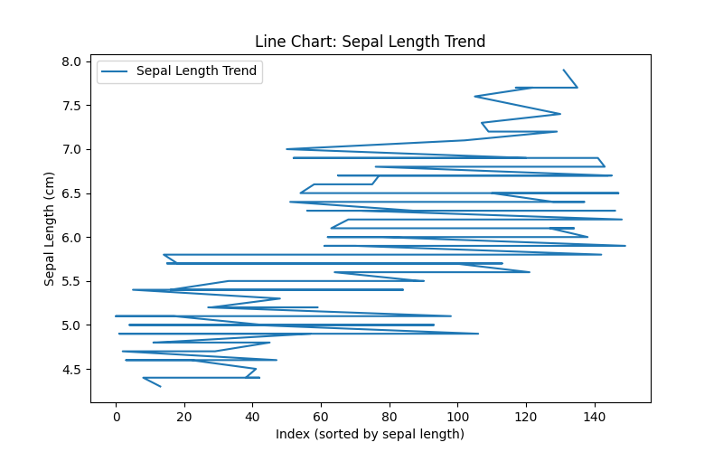
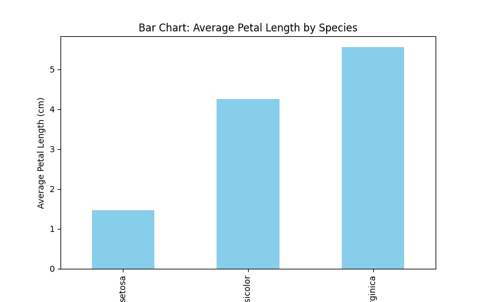
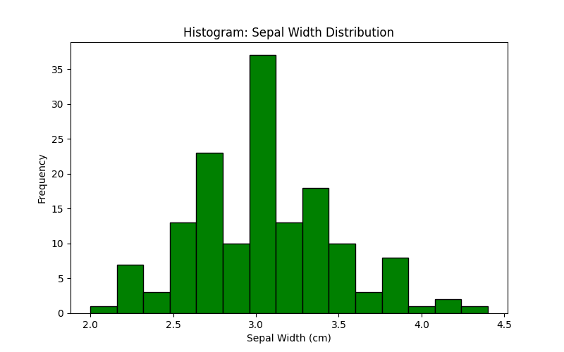
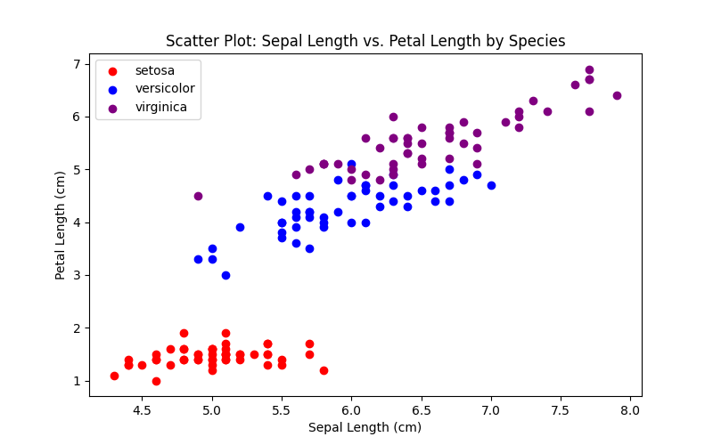

# Python_Pandas_Matplotlib_Analysis_Data_Exploration

This repository contains three Python tasks that demonstrate data loading, analysis, and visualization using the **Iris dataset**.
The project highlights skills in **pandas**, **matplotlib**, and **scikit-learn** for structured data analysis.

---

## Project Structure

```
Python_Pandas_Matplotlib_Analysis_Data_Exploration/
│
├── task1_load_explore.py       # Load dataset & explore with pandas
├── task2_analysis.py           # Perform descriptive statistics & correlations
├── task3_visualization.py      # Create visualizations & save plots
├── main.py                     # Run all tasks in sequence
├── requirements.txt            # Project dependencies
├── images/                     # Saved plots
└── README.md                   # Documentation
```

---

## Setup Instructions

1. **Clone the repository**

   ```bash
   git clone https://github.com/NJAU-NICKSON/Python_Pandas_Matplotlib_Analysis_Data_Exploration.git

   cd Python_Pandas_Matplotlib_Analysis_Data_Exploration
   ```

2. **Create and activate a virtual environment**

   ```bash
   python -m venv venv
   source venv/bin/activate   # Mac/Linux
   venv\Scripts\activate      # Windows
   ```

3. **Install dependencies**

   ```bash
   pip install -r requirements.txt
   ```

---

## How to Run

### Run individual tasks:

```bash
python task1_load_explore.py
python task2_analysis.py
python task3_visualization.py
```

### Run everything in sequence:

```bash
python main.py
```

---

## Sample Outputs

### Task 1 – Data Loading and Exploration

Console output:

```
First 5 rows:
   sepal length (cm)  sepal width (cm)  petal length (cm)  petal width (cm) species
0                5.1               3.5                1.4               0.2  setosa
1                4.9               3.0                1.4               0.2  setosa
...

Dataset Info:
<class 'pandas.core.frame.DataFrame'>
RangeIndex: 150 entries, 0 to 149
...
```

---

### Task 2 – Data Analysis

Console output:

```
Descriptive Statistics:
       sepal length (cm)  sepal width (cm)  petal length (cm)  petal width (cm)
count         150.000000        150.000000         150.000000        150.000000
mean            5.843333          3.057333           3.758667          1.199333
...

Correlation Matrix:
                   sepal length (cm)  ...  petal width (cm)
sepal length (cm)           1.000000  ...          0.817941
...
```

---

### Task 3 – Data Visualization

All plots are automatically saved in the `images/` folder and displayed.

#### Line Chart – Sepal Length Trend



#### Bar Chart – Average Petal Length by Species



#### Histogram – Sepal Width Distribution



#### Scatter Plot – Sepal Length vs Petal Length by Species



---

## Requirements

See [requirements.txt](requirements.txt):

```
pandas
matplotlib
seaborn
scikit-learn
```

---

## Notes

* Make sure to activate your virtual environment before running scripts.
* All visualizations are saved in `images/` for easy reference and use in reports or portfolios.

---


